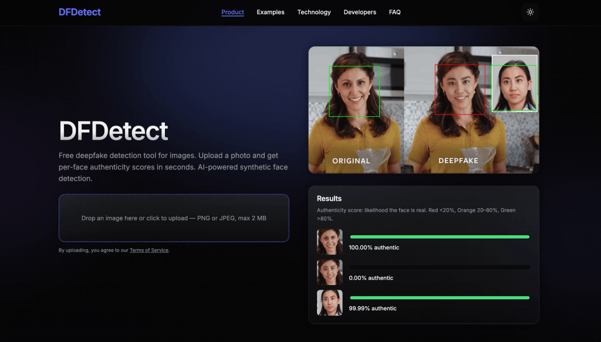

<div align="center">

# DeepFake-Detect

[](https://opensource.org/licenses/MIT)
[](https://www.python.org/downloads/)
[](https://www.tensorflow.org/)
[](https://keras.io/)
[](https://github.com/aaronchong888/DeepFake-Detect/stargazers)
[](https://github.com/aaronchong888/DeepFake-Detect/network/members)

<p align="center">
  <a href="https://deepfake-detect.com/"></a>
</p>

**Open-source deepfake detection & face forgery detection — train your own model with TensorFlow, Keras & EfficientNet**

[**Live Demo**](https://deepfake-detect.com/) · [Report Bug](https://github.com/aaronchong888/DeepFake-Detect/issues) · [Request Feature](https://github.com/aaronchong888/DeepFake-Detect/issues)

</div>

---

## About

**DeepFake-Detect** is an open-source pipeline for training **deepfake detection** and **face forgery detection** models from scratch. Built with [Python](https://www.python.org), [Keras](https://keras.io), and [TensorFlow](https://www.tensorflow.org), the detector uses an **EfficientNet** backbone and is trained on major public benchmarks (FaceForensics++, Celeb-DF, DFDC, and others) to recognize synthetic faces and manipulated media.

---

## Features

- **EfficientNet-based architecture** — State-of-the-art backbone with 128×128 input, global max pooling, and binary classification head (pristine vs deepfake).
- **Multi-dataset training** — Supports five major public benchmarks (FaceForensics++, Celeb-DF, DFDC, DFD, DeepFake-TIMIT) for robustness across ~20 synthesis methods.
- **End-to-end pipeline** — From raw videos to trained model: frame extraction → face cropping (MTCNN or Azure Vision API) → dataset balancing & split → training.
- **Live web demo** — Try the model at [deepfake-detect.com](https://deepfake-detect.com/) without installing anything.

---

## Demo

<p align="center">
  
</p>

<p align="center">
  <strong><a href="https://deepfake-detect.com/">Try the live demo → deepfake-detect.com</a></strong>
</p>

---

## Quick Start

### Prerequisites

- **Python 3**
- **Keras**
- **TensorFlow**
- **EfficientNet** for TensorFlow Keras
- **OpenCV** on Wheels
- **MTCNN** (or **Azure Computer Vision API** for cloud-based face cropping)

### Install & run pipeline

```bash
# Clone and install dependencies
git clone https://github.com/aaronchong888/DeepFake-Detect.git
cd DeepFake-Detect
pip install -r requirements.txt

# Run the full pipeline (after placing your dataset videos as expected by the scripts)
python 00-convert_video_to_image.py    # Extract frames
python 01a-crop_faces_with_mtcnn.py    # Crop faces (or 01b for Azure)
python 02-prepare_fake_real_dataset.py # Balance & split train/val/test
python 03-train_cnn.py                 # Train EfficientNet classifier
```

---

## Training Datasets

The model is trained on the following public deepfake datasets to cover diverse identities and synthesis methods:

| Dataset | Link |
|---------|------|
| DeepFake-TIMIT | [https://www.idiap.ch/dataset/deepfaketimit](https://www.idiap.ch/dataset/deepfaketimit) |
| FaceForensics++ | [https://github.com/ondyari/FaceForensics](https://github.com/ondyari/FaceForensics) |
| Google DFD | [https://ai.googleblog.com/2019/09/contributing-data-to-deepfake-detection.html](https://ai.googleblog.com/2019/09/contributing-data-to-deepfake-detection.html) |
| Celeb-DF | [https://github.com/danmohaha/celeb-deepfakeforensics](https://github.com/danmohaha/celeb-deepfakeforensics) |
| Facebook DFDC | [https://ai.facebook.com/datasets/dfdc/](https://ai.facebook.com/datasets/dfdc/) |

<p align="center">
  
</p>

**Aggregate scale (approximate):** ~134,446 videos · ~1,140 identities · ~20 synthesis methods.

---

## Pipeline Overview

| Step | Script | Description |
|------|--------|-------------|
| **0** | `00-convert_video_to_image.py` | Extract frames from videos; resize by width (2× if &lt;300px, 1× for 300–1000px, 0.5× for 1000–1900px, 0.33× if &gt;1900px). |
| **1a** | `01a-crop_faces_with_mtcnn.py` | Crop faces with [MTCNN](https://github.com/ipazc/mtcnn) (30% margin, 95% confidence). Multiple faces per frame saved separately. |
| **1b** | `01b-crop_faces_with_azure-vision-api.py` | Optional: use [Azure Computer Vision API](https://azure.microsoft.com/en-us/services/cognitive-services/computer-vision/) for face cropping (set API name & key in script). |
| **2** | `02-prepare_fake_real_dataset.py` | Down-sample fakes to match real count; split into train/val/test (e.g. 80:10:10). |
| **3** | `03-train_cnn.py` | Train EfficientNet B0 backbone → global max pooling → 2× FC (ReLU) → sigmoid. Input 128×128 RGB; output probability pristine (1) vs deepfake (0). |


#### Step 0 - Convert video frames to individual images

```
python 00-convert_video_to_image.py
```

Extract all the video frames from the acquired deepfake datasets above, saving them as individual images for further processing. In order to cater for different video qualities and to optimize for the image processing performance, the following image resizing strategies were implemented:

- 2x resize for videos with width less than 300 pixels
- 1x resize for videos with width between 300 and 1000 pixels
- 0.5x resize for videos with width between 1000 and 1900 pixels
- 0.33x resize for videos with width greater than 1900 pixels

#### Step 1 - Extract faces from the deepfake images with MTCNN

```
python 01a-crop_faces_with_mtcnn.py
```

Further process the frame images to crop out the facial parts in order to allow the neural network to focus on capturing the facial manipulation artifacts. In cases where there are more than one subject appearing in the same video frame, each detection result is saved separately to provide better variety for the training dataset.

- The pre-trained MTCNN model used is coming from this GitHub repo: https://github.com/ipazc/mtcnn
- Added 30% margins from each side of the detected face bounding box
- Used 95% as the confidence threshold to capture the face images

#### (Optional) Step 1b - Extract faces from the deepfake images with Azure Computer Vision API

In case you do not have a good enough hardware to run MTCNN, or you want to achieve a faster execution time, you may choose to run **01b** instead of **01a** to leverage the [Azure Computer Vision API](https://azure.microsoft.com/en-us/services/cognitive-services/computer-vision/) for facial recognition.

```
python 01b-crop_faces_with_azure-vision-api.py
```

> Replace the missing parts (*API Name* & *API Key*) before running

#### Step 2 - Balance and split datasets into various folders

```
python 02-prepare_fake_real_dataset.py
```

As we observed that the number of fakes are much larger than the number of real faces (due to the fact that one real video is usually used for creating multiple deepfakes), we need to perform a down-sampling on the fake dataset based on the number of real crops, in order to tackle for possible class imbalance issues during the training phase. 

We also need to split the dataset into training, validation and testing sets (for example, in the ratio of 80:10:10) as the final step in the data preparation phase.

#### Step 3 - Model training

```
python 03-train_cnn.py
```

EfficientNet is used as the backbone for the development work. Given that most of the deepfake videos are synthesized using a frame-by-frame approach, we have formulated the deepfake detection task as a binary classification problem such that it would be generally applicable to both video and image contents.

In this code sample, we have adapted the EfficientNet B0 model in several ways: The top input layer is replaced by an input size of 128x128 with a depth of 3, and the last convolutional output from B0 is fed to a global max pooling layer. In addition, 2 additional fully connected layers have been introduced with ReLU activations, followed by a final output layer with Sigmoid activation to serve as a binary classifier. 

Thus, given a colored square image as the network input, we would expect the model to compute an output between 0 and 1 that indicates the probability of the input image being either deepfake (0) or pristine (1).

---

## FAQ

**How do I detect if an image is a deepfake?**  
Use the [live demo](https://deepfake-detect.com/) or run the trained model on a face crop (128×128). The model outputs a score: higher = more likely pristine, lower = more likely synthetic.

**Can I train on my own deepfake dataset?**  
Yes. Follow the pipeline: put videos in the expected layout, run the scripts in order (frame extraction → face crop → prepare dataset → train). You can mix your data with the public datasets.

**What deepfake methods does this detect?**  
The default model is trained on ~20 methods across FaceForensics++, Celeb-DF, DFDC, DFD, and DeepFake-TIMIT, so it generalizes to many common face-swap and manipulation techniques.

---

## Star History

[](https://star-history.com/#aaronchong888/DeepFake-Detect&Date)

---

## Contributing

Contributions are welcome. Please open an [issue](https://github.com/aaronchong888/DeepFake-Detect/issues) or submit a [pull request](https://github.com/aaronchong888/DeepFake-Detect/pulls).

---

## Citing

If you use DeepFake-Detect in research or a project, please cite:

```bibtex
@software{deepfake_detect,
  title = {DeepFake-Detect: Open-Source Deepfake Detection Pipeline},
  author = {Chong, Aaron and Ng, See Long Hugo},
  year = {2020},
  url = {https://github.com/aaronchong888/DeepFake-Detect},
  note = {Train deepfake detection models with TensorFlow, Keras \& EfficientNet}
}
```

---

## Authors & License

- **[Aaron Chong](https://github.com/aaronchong888)** — *Initial work & Maintenance*
- **[Hugo Ng](https://github.com/hugoclong)** — *Initial work*

See [contributors](https://github.com/aaronchong888/DeepFake-Detect/contributors) for the full list.

**License:** [MIT](LICENSE).

**Acknowledgments:** Dependencies are listed in the [dependency graph](https://github.com/aaronchong888/DeepFake-Detect/network/dependencies).


